### 分形图案

|                      |                          第1次迭代                           |                          第2次迭代                           |                          第n次迭代                           |
| :------------------: | :----------------------------------------------------------: | :----------------------------------------------------------: | :----------------------------------------------------------: |
|      koch_curve      |                       |                       |           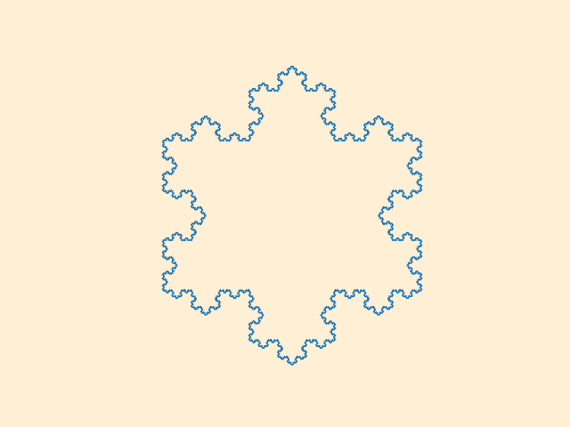            |
|   pythagoras_tree    |             |             |     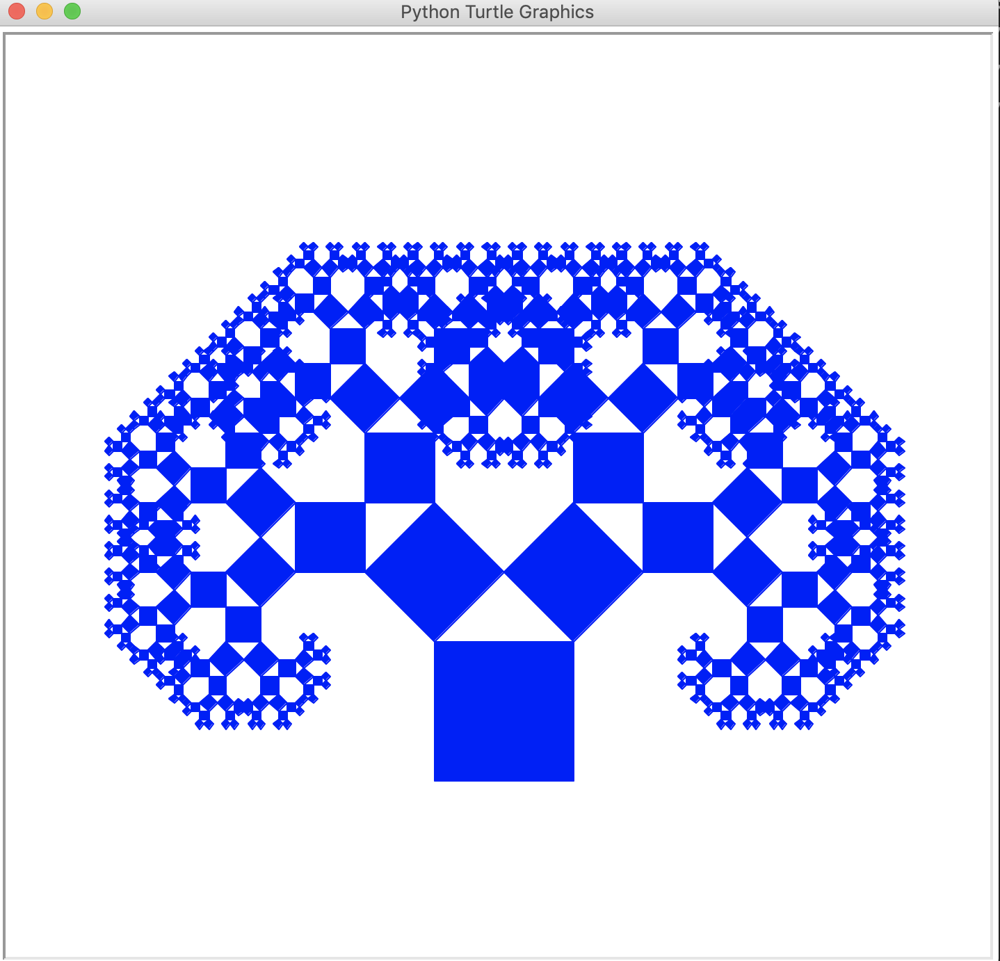      |
|     dragon_curve     |                   |         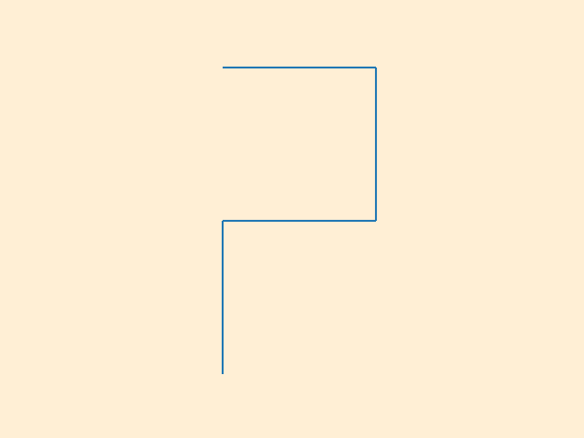          |        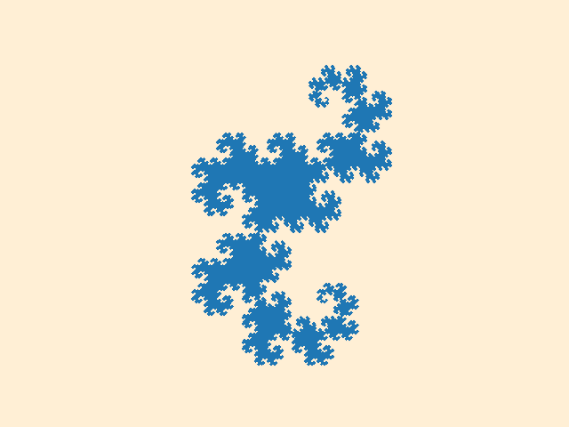         |
| sierpinski_triangle  |  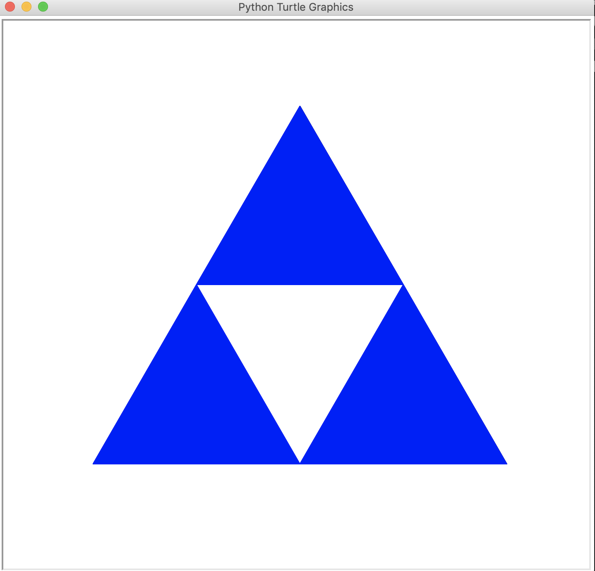   |  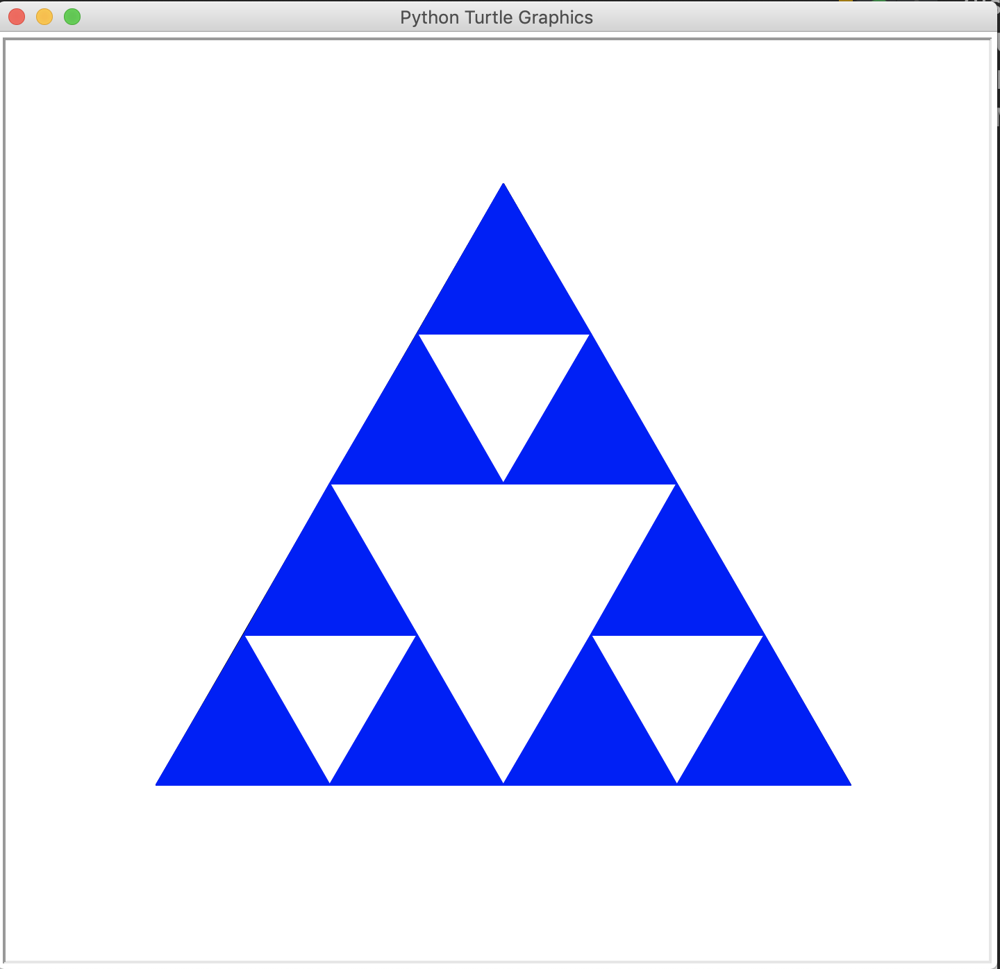   |  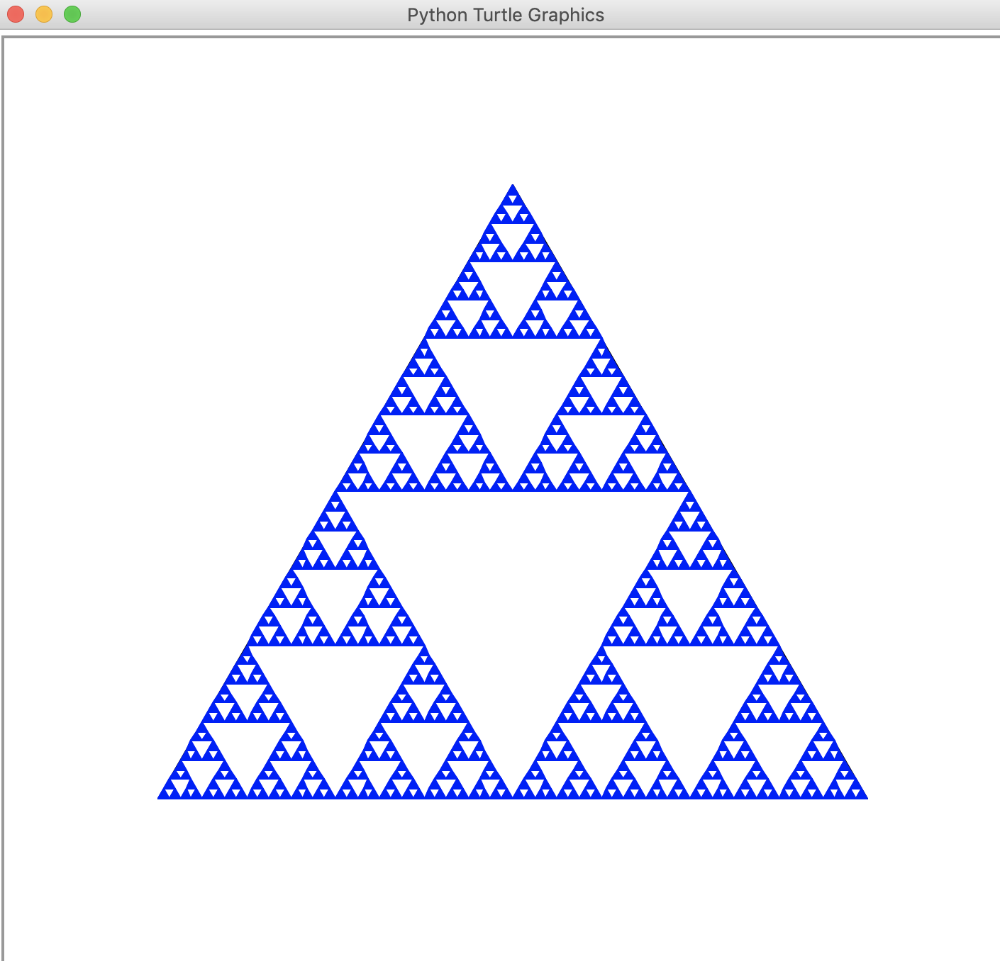   |
| sierpinski_triangle2 | 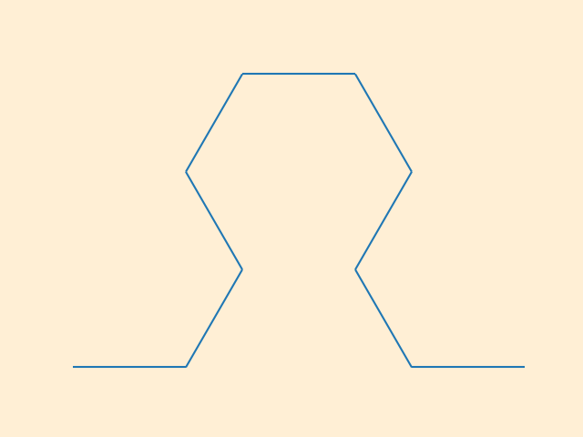 | 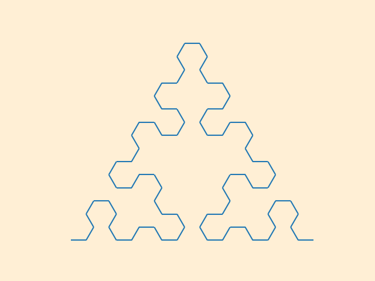 | 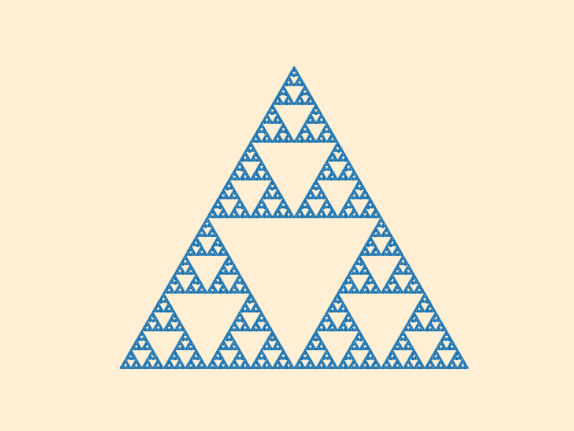 |
| sierpinski_triangle3 | 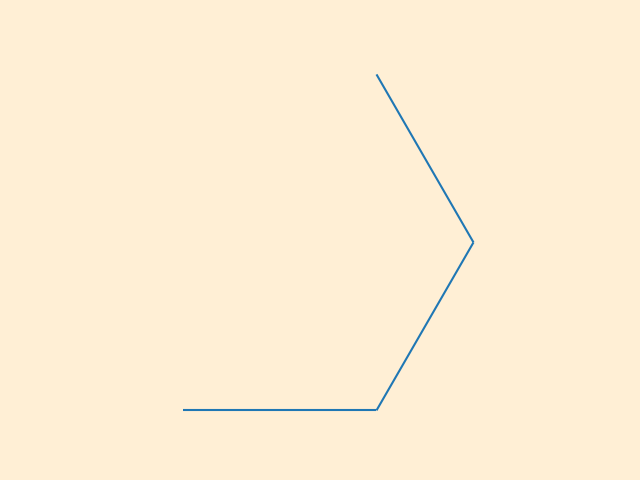 | 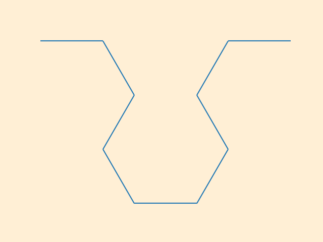 | 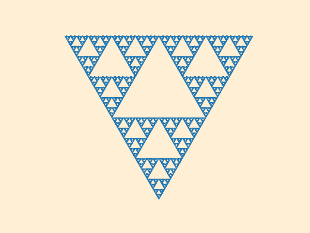 |
|      sierpinski      |           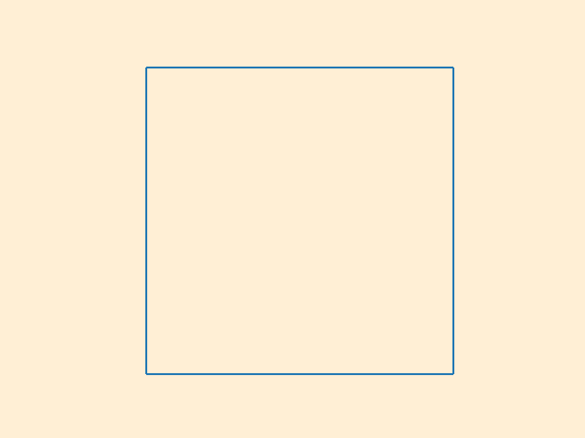            |           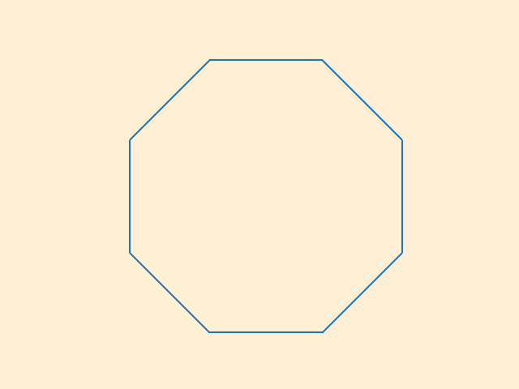            |          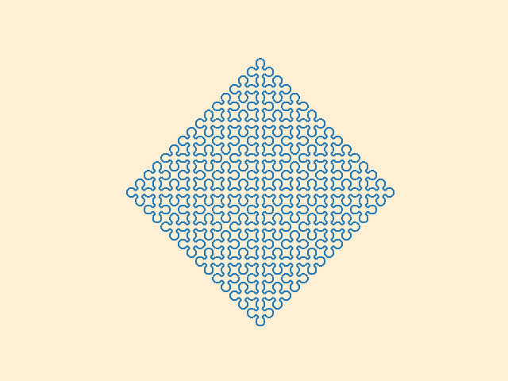           |
|        lvey_c        |               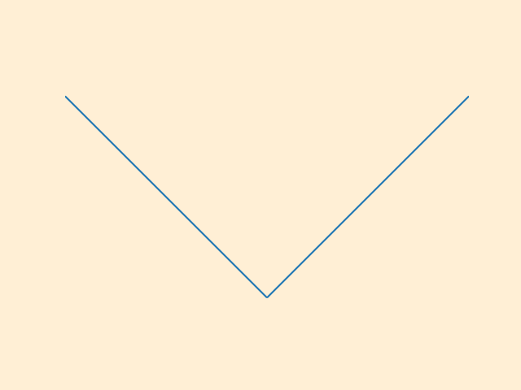                |               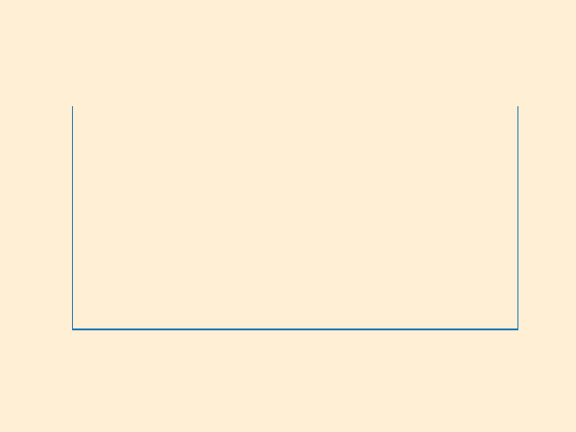                |              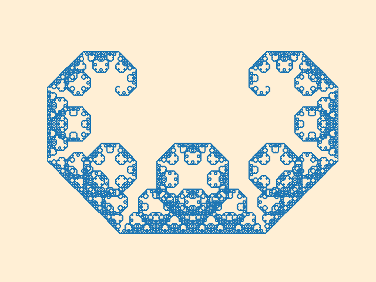               |
|       hilbert        |              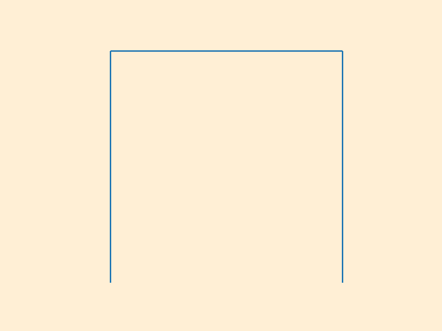               |              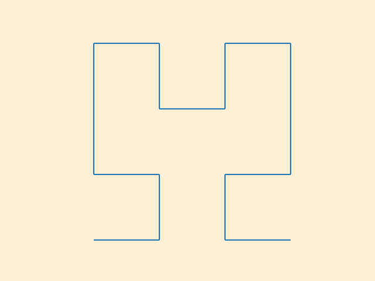               |              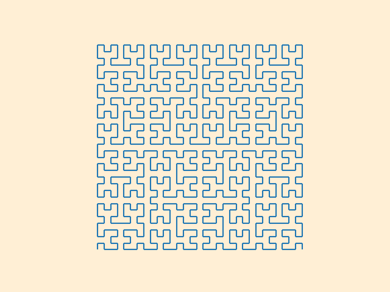               |
|         leaf         |                 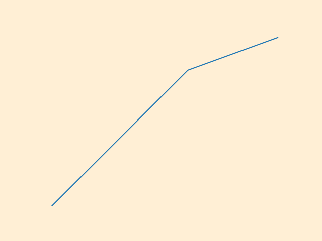                  |                 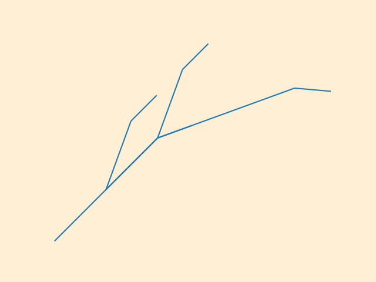                  |                 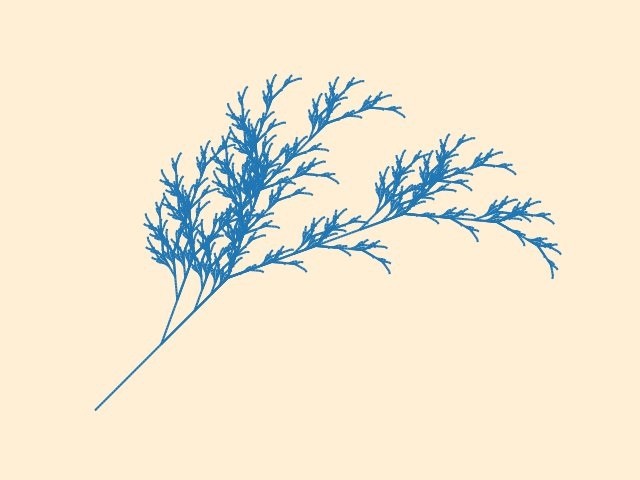                  |

