### 关于作图

显函数作图太简单，这里忽略。

隐函数作图比较麻烦。

可以作z=f(x,y)的图像，然后再作z=0时的等高线。

### 关于图像

#### 心形图案

| 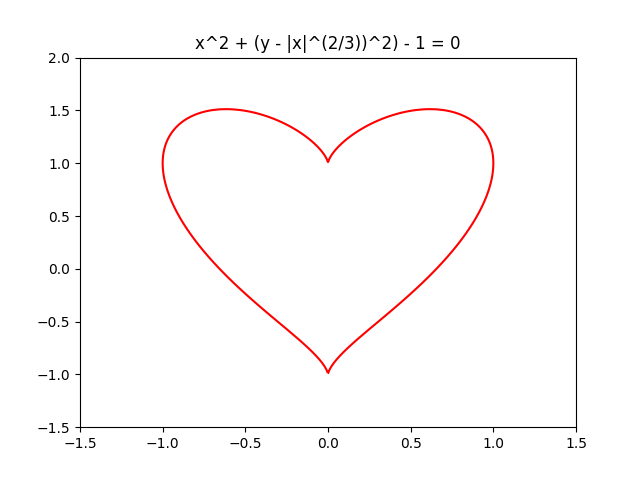 | 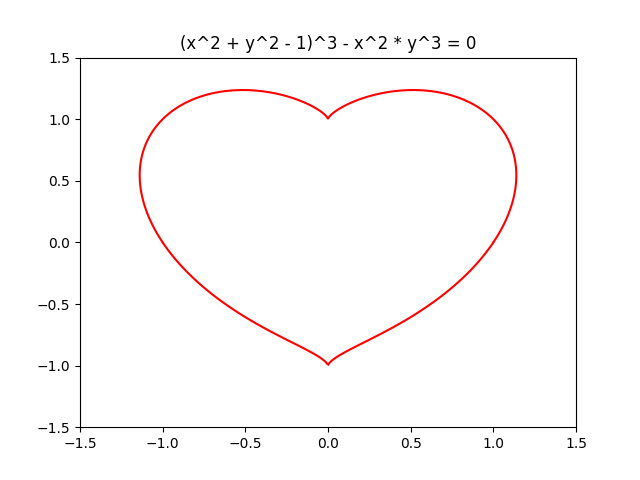 | 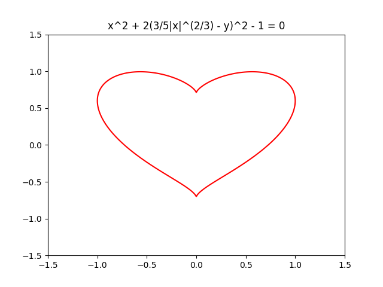 |
| ------------------------------- | ------------------------------- | ------------------------------- |
| 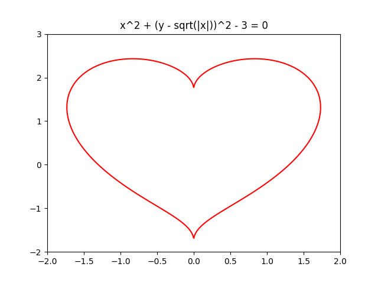 | 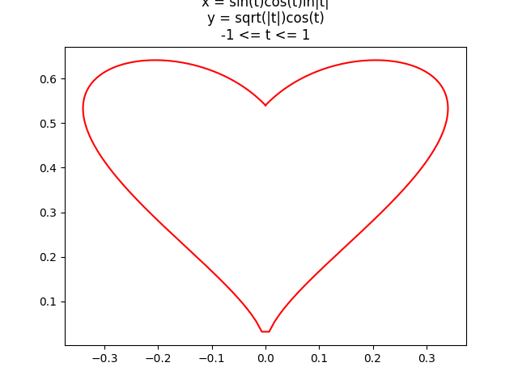 | 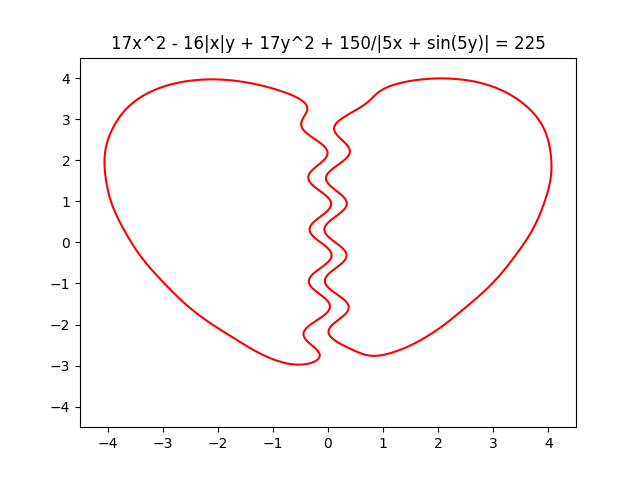 |
| 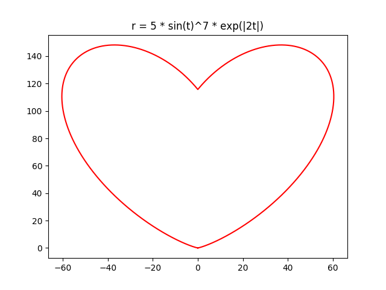 | 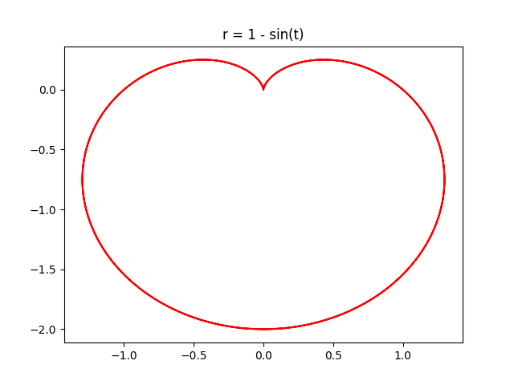 |                                 |

#### 象形图案

| 最喜欢的图案 | 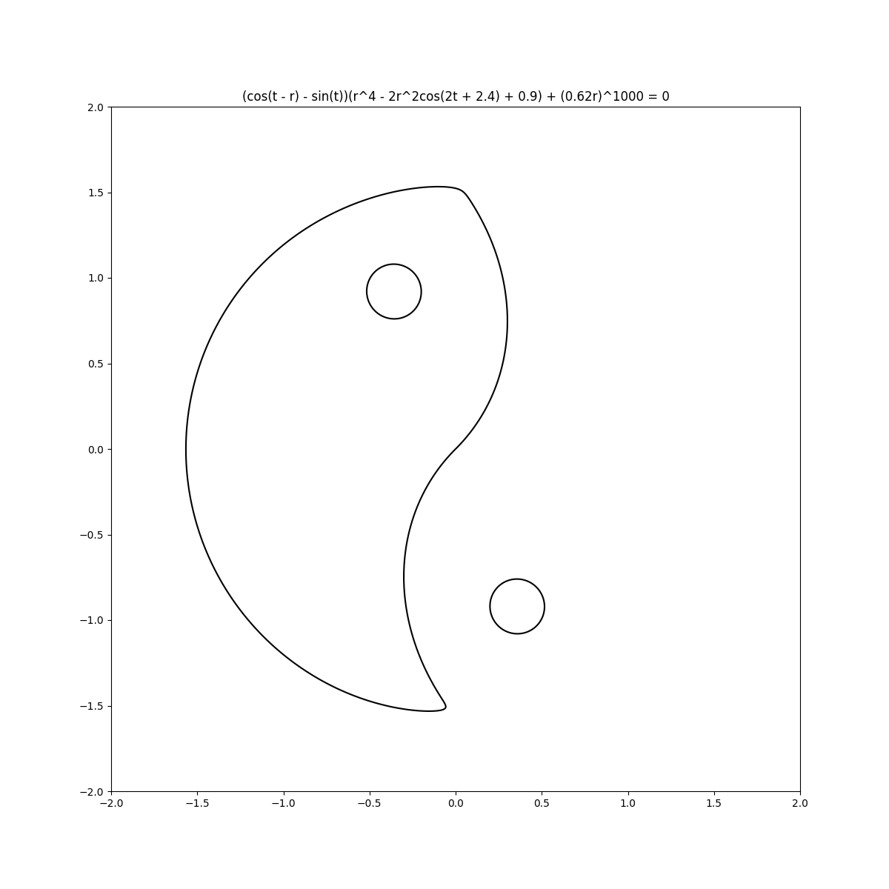 | 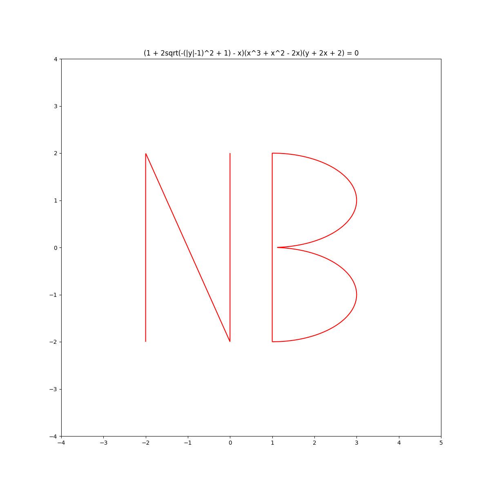 |
| :-----------------------------------------: | :-------------------------: | :---------------: |
|                        |                             |                   |

#### 其它图案

|  | 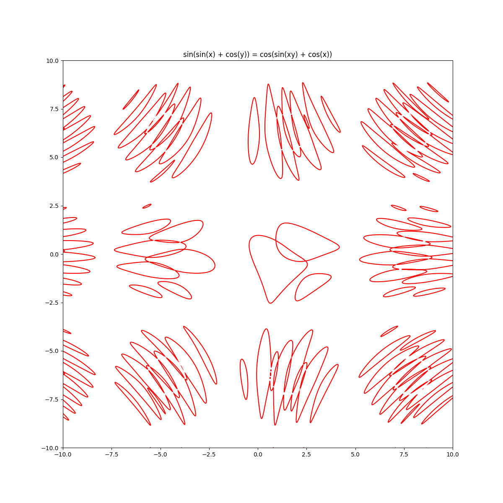 | 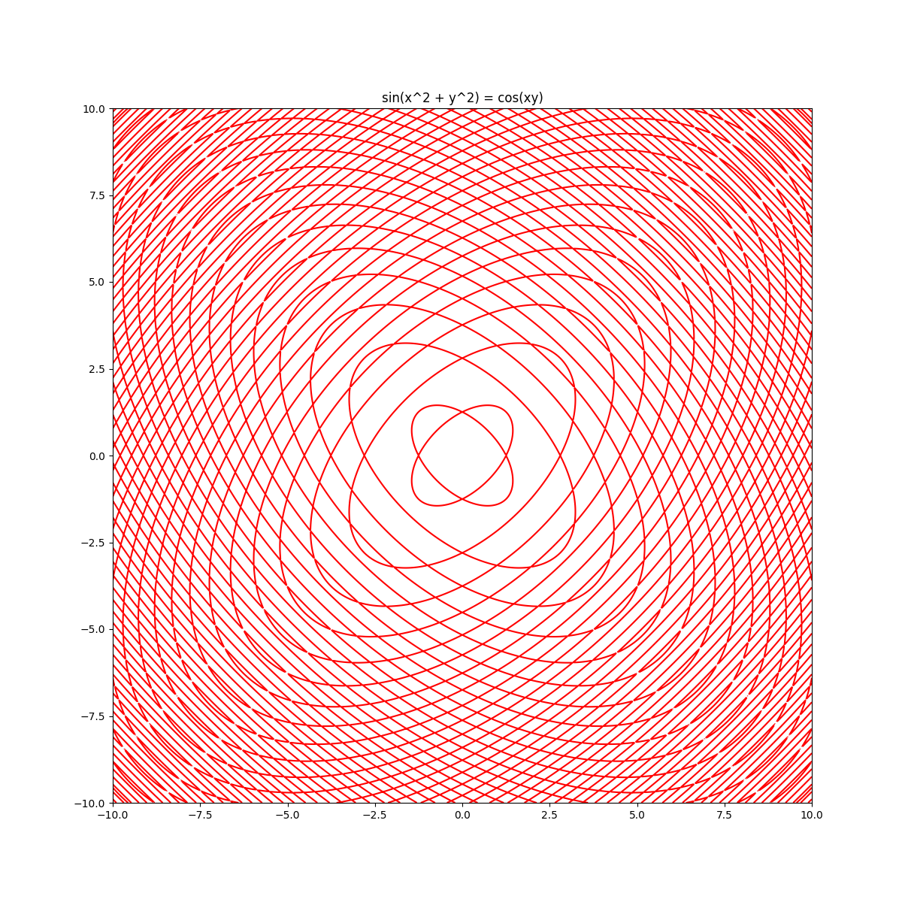 |
| ------------------------------- | ------------------------------- | ------------------------------- |
|  | 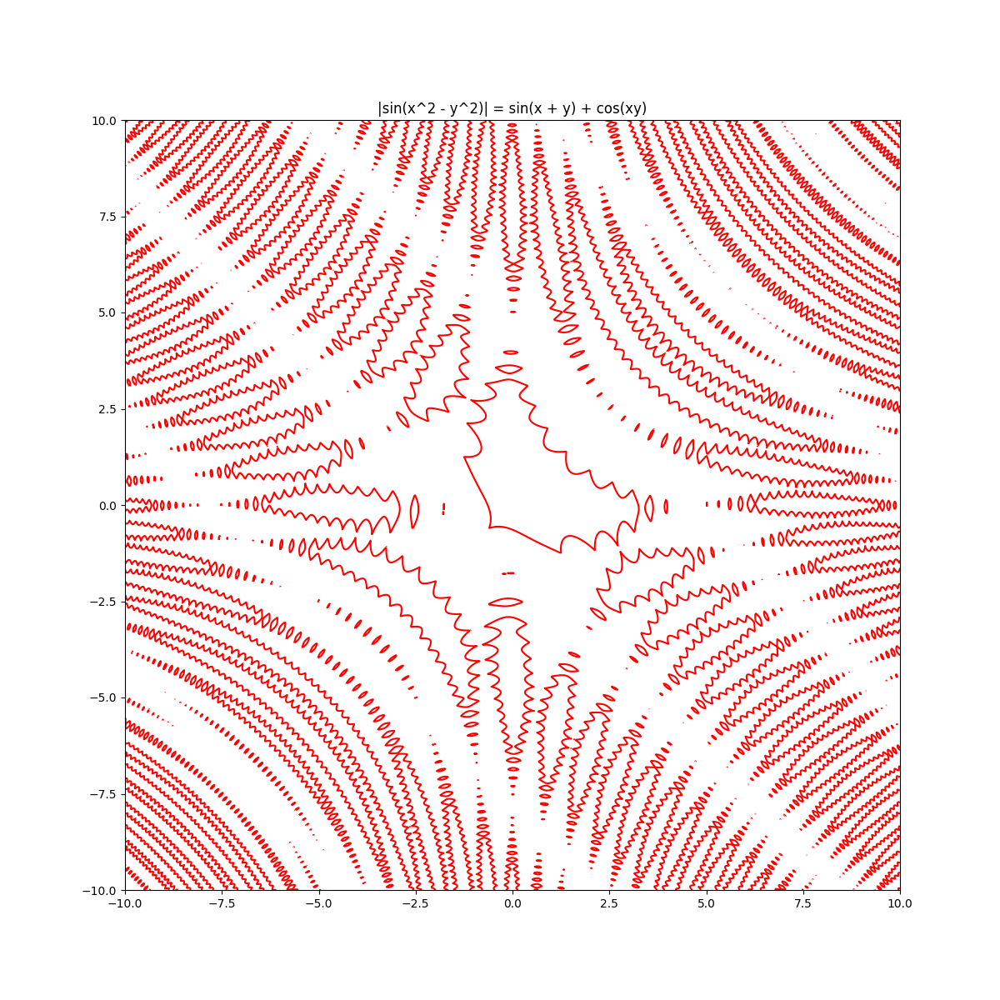 | 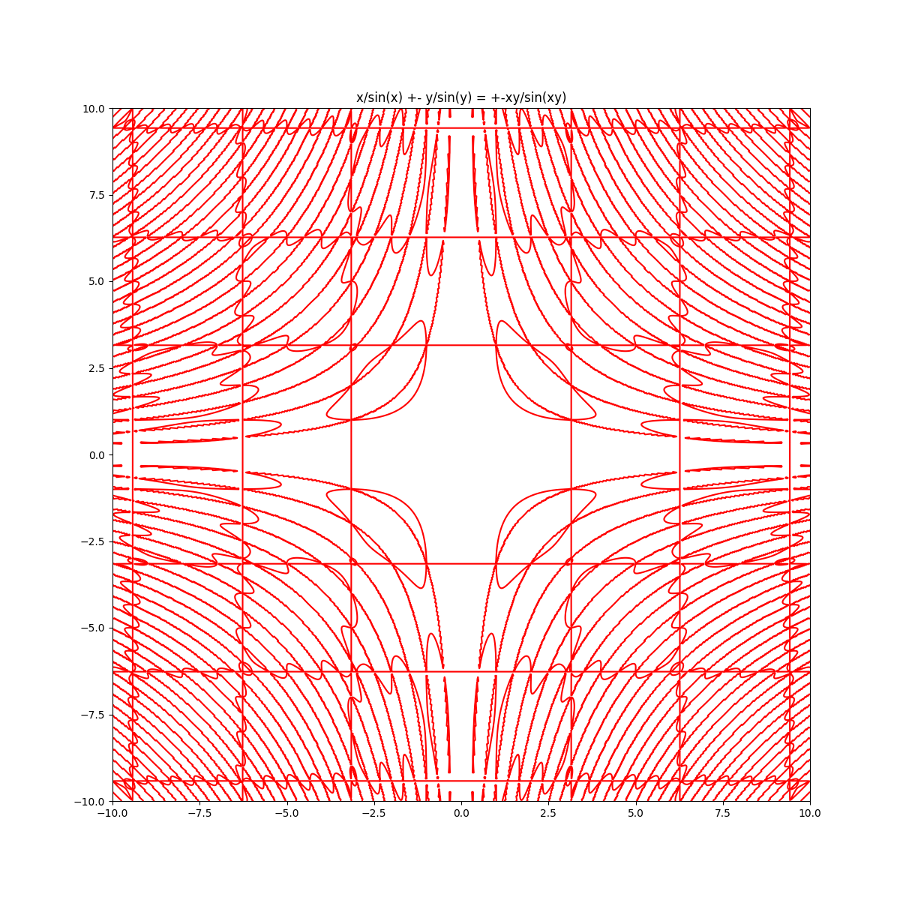 |
|  |  |  |
|                                 |                                 |                                 |

（待续。。。）

### 关于作图软件

####  [GrafEq](http://www.peda.com/grafeq/)

神级作图软件，图像绘制能力异常强大，但不能绘制3d图像。

支持Windows、Mac os 9

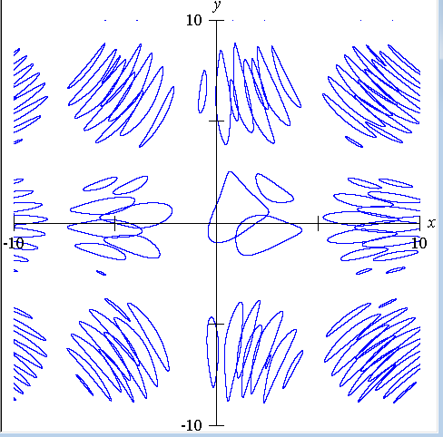

#### grapher

Mac自带作图软件，精细程度一般

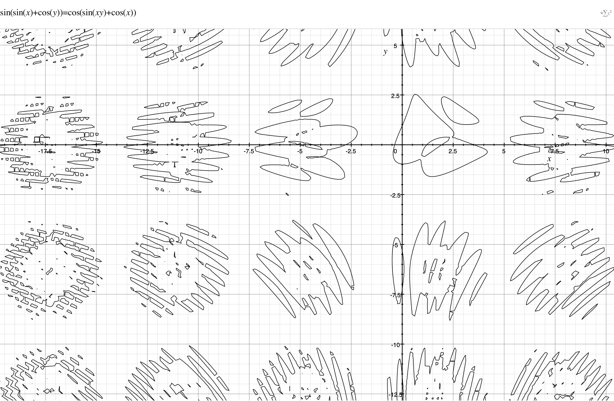

可以做3d图像

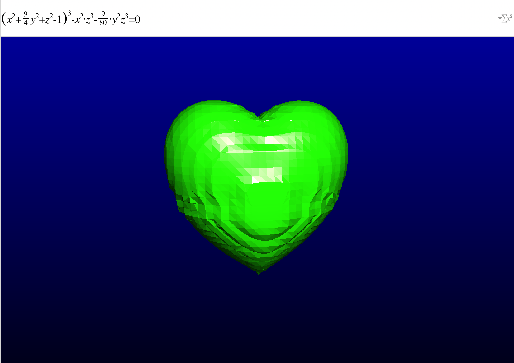

